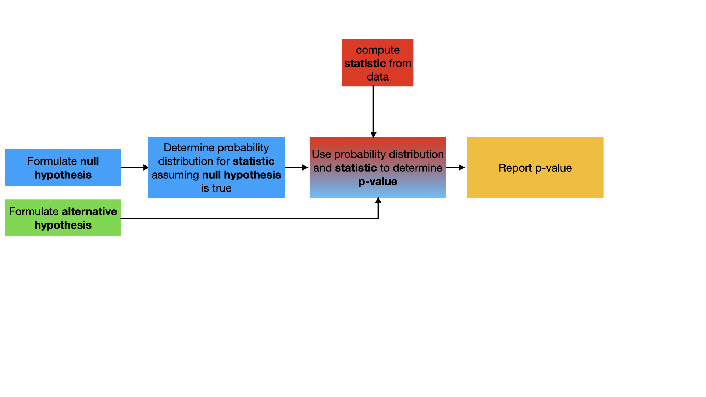
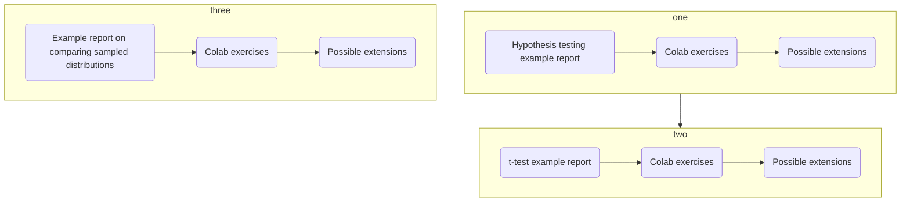

# Hypothesis testing

Let's suppose that we have performed an experiment or simulation and obtained a result. The exercises on [random variables and probability](Random_variables.md) have 
discussed at length how we should treat any numerical results that we have obtained as random variables. Consequently, whenever we report our results from our results 
we must use what we learned about from those earlier exercises to characterize the distribution that was sampled in the experiment or simulation. Others can then use the 
tools of hypothesis testing when engaging in dialogue with our results. 

Hypothesis testing allows people to use the information on the distribution that was sampled in our experiment/simulation to determine whether they sampled the same distribution 
in their experiment/simulation. We can thus use hypothesis testing to determine if the differences between the results obtained from different experiments or simulations are 
statistically significant or not. Alternatively, such methods can also be used to determine if the differences obseved when different populations are sampled are the statistically signficant or not.

To perform a hypothesis test you follow the proecedure that is illustrated in the flow chart below:

This procedure involves calculating a __test statistic__ using the data from your experiment/simulation. You then formulate a __null hypothesis__ that typically 
states that the __test statistic__ might be a sample from a particular statistical distribution with known parameters and an __alternative hypothesis__ that states that the __test statistic__ is not a sample from this distribution. The core of the hypothesis test is the calculation of a __p-value__ that gives the probability that you have obtained a false negative result. In other words, the __p-value__ tells you the conditional probability of observing a result that is __consistent with the alternative hypothesis__ if __the distribution that was assumed under the null hypothesis__ was the distribution that was sampled when you computed the __test statistic__ from your data.

When reporting the result of the hypothesis test you typically state that __the null hypothesis is rejected in favour of alternative__ if the __p-value is less than the signifance level__ for the test (typically 5 %). If the __p-value__ is greater than __the significance level__ you instead state that __there is insufficient evidence to reject the null hypothesis__. Statistical tests do not ever provide you with evidence required for "accepting the null hypothesis". In other words, hypothesis testing never allows us to state with certainty that the results from two different experiments are "the same." The most we can say is that there is little evidence to suggest that the results are different. 

