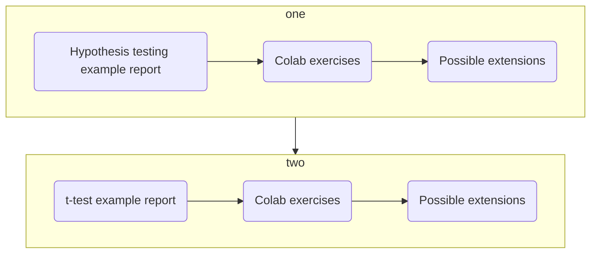

# Hypothesis testing

```mermaid
flowchart TD
  subgraph one
    direction LR
    A("Hypothesis testing example report") --> B("Colab exercises")
    B --> C("Possible extensions")
  end
  one --> two
  subgraph two
    direction LR
    D("t-test example report") --> E("Colab exercises")
    E --> F("Possible extensions")
  end
  click A "hypothesis/hypothesis_testing_basic.pdf" "An example report exploring hypothesis testing by treating the p-values you obtain as random variables"
  click B "README.md" "Colab exericses to introduce you to the basics of hypothesis testing"
  click C "hypothesis/extensions1.html" "Suggested extension activities on hypothesis testing for you to persue"
  click D "hyypothesis/t-tests.pdf" "An example report exploring performing hypothesis tests using t-tests"
  click E "README.md" "Colab exercises on performing hypothesis using Student-t distribution"
  click F "hypothesis/extensions2.html" "Suggested extension activities on performing hypothesis tests using the t-distribution for you to persue"
```
