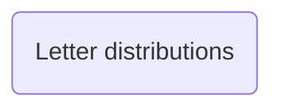

# Natural Language Processing

The technolgy companies have developed multipled algorithms for manipulating language. The obvious application are the large language models 
that are the workhorse of generative AI apps such as ChatGPT, Claude and so on. However, Google search, the targetted avertising of facebook 
or even Spotify recommendations for what to listen to next are all reliant on our ability to use mathematical algorithms to parse
textual data.

The fact that we can use mathematical algorithms running on a computer to make sense of English language appears counterintuitive. Most of the 
mathematics you have learned has been about manipulating numbers even if the numbers are sometimes hidden under various layers of abstraction.  
Furthermore, all the computer programming that you have done in your degree so far has involved manipulating numbers.  The exercises below 
thus serve to explain how to encode combinations of letters and words (the rudiments of language) using mathematical objects 
that we can then manipulate using a computer.  We hope that showing you some of these ideas will help you to think about the second stage in 
the mathematics pipeline that we have discussed in the lecture. In other words, these exercises will show you how we can encode a problem about language
in mathematics.

