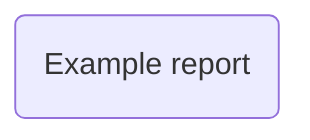

# Mathematical objects

One way of thining about mathematics is as a language that we can use to describe to describe our experiences in the real world.
To use mathematics in this way you have to understand the various abstract objects that mathematics concerns itself with and the 
different types of phenomenon we can describe using these objects. These objects include things such as numbers, functions, vectors,
sets, matrices, operators, groups and tensors. The differences between these different types of mathematical object are often rather subtle.

The activities in this block will encourage you to think about these some different types of mathematical object. You will learn how we can 
manipulate all these types of objects in python.  Furthermore, the example reports will illustrate the different ways that these objects can 
be used.

