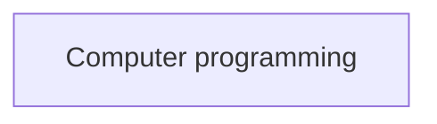

# Programming

We are encouraging you to learn Python programming in this module because programming is a powerful tool for teaching mathematics. Writing programs allows students to turn abstract concepts 
like numbers and function into visual and tangible explorations. It is particularly useful for getting students to think about the relationship between geometry and algebra because you can 
quickly write python programs to plot functions. The colab notebook that is linked below introduces you to the following ideas:

* Using scalar-valued variables
* Using NumPy arrays 
* Using loops to perform repeated actions
* Plotting graphs using matplotlib
* Using if loops to control the flow of your programs

If you think you can write programs to do all these things, you can skip this block of exercises and go directly to the more mathematical activities.

