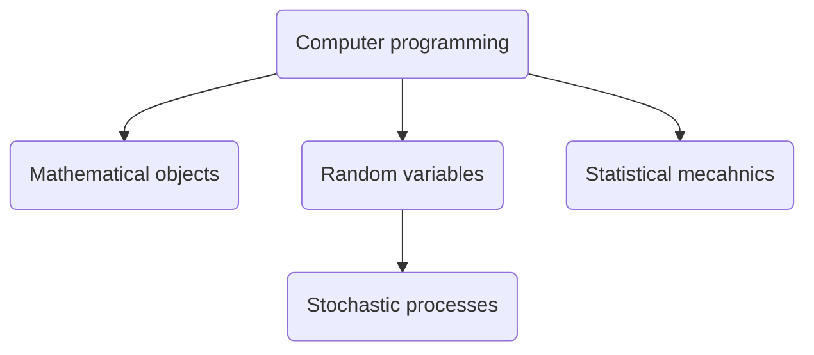

The central premise of this module is that you __do not__ become a mathematicain __by knowing__ mathamatics. You become a mathematician __by doing__ mathematics. Computers are a remarkable tool for helping people to do mathematics. The linked pages below thus provide you countless opportunities to __do mathematics using a computer.__ As the __only qualification__ for being a mathematician is __doing mathematics__ you can work through these activities in any order. However, following the arrows might make this process a little easier. 

Lastly, note that, even if you get an artificial intelligence to complete these activities, you are still doing mathematics. The goal for all the exercises in this module is for you to:

- Communicate what you have done
- Communicate why you did it
- Communicate how you did did
- Communicate what you found out

The module assesses you in the fundamental skill we believe __all students__ need to learn from a modern university: __to choose__ a thing to do, __to follow through__ on doing that thing and __to convince__ someone else that the thing you have done is __valuable__.

## How this site works

Clicking each of the links in the graph above takes you to a new page that introduces a particular topic in mathematics using a combination of text, videos and short programming exercises. You do these programming exercises using the Google Colab cloud environment that is explained in the following video:

<iframe width="560" height="315" src="https://www.youtube.com/embed/mZ01DFliVsE?si=n1SSR6dzo5uJIDVh" title="YouTube video player" frameborder="0" allow="accelerometer; autoplay; clipboard-write; encrypted-media; gyroscope; picture-in-picture; web-share" referrerpolicy="strict-origin-when-cross-origin" allowfullscreen></iframe>

You can get automated feedback from Colab when you complete each exercise that will tell you whether what you have done is right or wrong. 

The exercises serve as the jumping off point for the module.  For the __early portfolio assignments__ you can submit graphs that you have __generated by completing these exercises.__  However, by the end of the semeter we hope that you are using what you have learned to __submit portfolio assignments__ that are based on __independent work__ that your group has done for a stakeholder.
