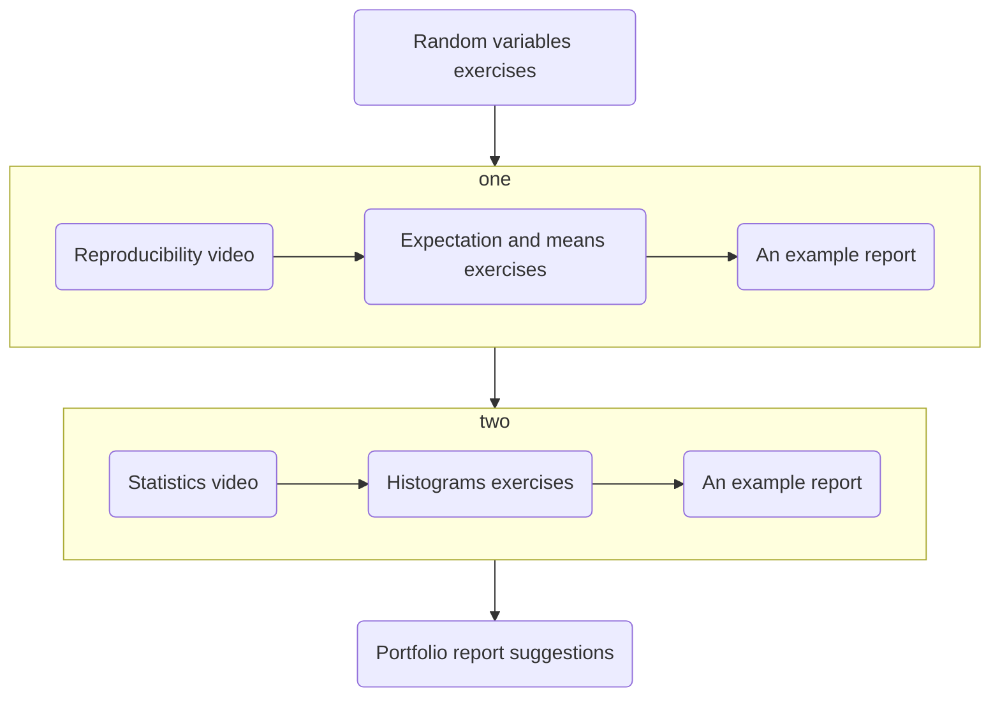

# Random variables and probability

Let's suppose we are trying to work out how many people will catch a bus that travels from Kesh to Enniskillen each day.  If we do not need the information before running the bus service, 
our best option is to sit on the bus and count folks on and off.  If we want the information before running the bus, then we would need to go and ask everyone who might have gotten the bus 
if they planned to get the bus.  Furthermore, even if we could ask everyone, they are not obligated to tell us the truth.  Determining exactly how many people will take the bus that runs 
in the future is thus near impossible, which is unfortunate as we need information on how many people take the bus to make decisions on whether or not to run a bus service along the Kesh 
to Enniskillen route or not. 

We introduce random variables to deal with problems such as predicting how many people will get the bus.  Random variables allow us to encode the things we do know into a model while 
also giving us to acknowledge that we do not know everything.  For example, in our bus example, we know:

The populations of all the towns along the proposed Kesh to Enniskillen route, $P_i$.
The fraction of people in a population of any size who routinely take the bus, $p$
We thus might model the number of people who take the bus as:

$$
\textrm{Number of people on bus} \approx \sum_i p P_i
$$

where the sum runs over the number of towns on the bus route, notice that which precise people are on the bus is kept random in this model.

The exercises below introduce you to various random variables that you can use to construct models like the one described above. The field that uses models like this is called 
Monte Carlo simulation. The later exercises below thus teach you how to analyse and report on the results you obtain when you perform Monte Carlo simulations.  You can find videos that 
explain key ideas that underpin this analysis and example reports that illustrate how you might incorporate the ideas that you have learned by doing the exercises in one of your portfolio
reports.

