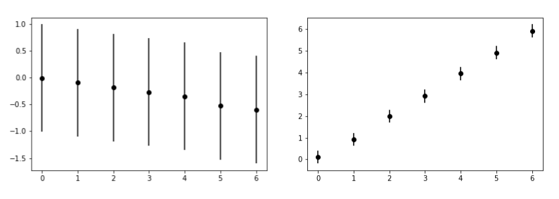

# Models, trends and random variables

Consider the two graphs shown below:

Both of these graphs were created by sampling a random variable that depends on a parameter. The y-values in the graph 
(the dependent variable) are averages obtained when we use the value of the x-axis of the graph (the independent variable) 
as the random-variable parameter.  The error bars show the error around these means for a 95% confidence limit.  Given this description, 
I want you to think about what these two graphs are telling you about the relationship between the independent and the dependent variables.  I
n the graph on the right, we see that the dependent variable increases as the independent variable increases.  For the graph on the left, the position 
of the mean decreases as the dependent variable increases.  However, all the points lie within the error bars of the other points.  We thus cannot say whether 
this decreasing trend is statistically significant or not.     

The point I want you to take from this example is that we need statistics to determine whether the patterns we see in data are real or flukes.  If you need further persuasion, 
try playing [this game](https://www.rossmanchance.com/applets/2021/guesscorrelation/GuessCorrelation.html).  We are biologically pre-disposed to see patterns in data.  
The tools of statistics allow us to overcome our natural biases.
